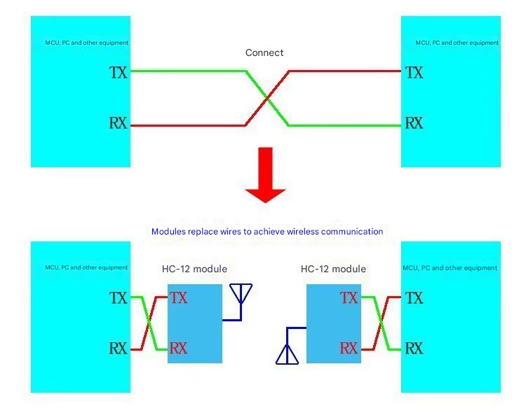

# HC-12 ESPHome Component

This repository provides an ESPHome external component for the HC-12 wireless serial transceiver module.

## Features
- Supports sending and receiving data using the HC-12 module
- Integrates with ESPHome's UART component
- Exposes received data as a text sensor

## Hardware Requirements
- ESP8266 or ESP32
- HC-12 module
- UART connection (TX, RX)
- HC-12 Pin Map 


## Installation

To use this component, add the following to your ESPHome YAML configuration. This fetches the latest version from GitHub.

For more details on external components, refer to the [ESPHome External Components documentation](https://esphome.io/components/external_components.html).


### 1. Add the external component to your ESPHome configuration
```yaml
external_components:
  - source: github://madurapa/esphome-hc12@main
```

### 2. Configure UART for the HC-12 module
```yaml
uart:
  id: uart_12
  tx_pin: GPIO12  # HC-12 TX
  rx_pin: GPIO14  # HC-12 RX
  baud_rate: 9600 # Default HC-12 baud rate
  rx_buffer_size: 256
```

### 3. Add the HC-12 component
```yaml
hc12:
  id: hc12_component
  uart_id: uart_12
```

## Examples

### Sending Example
This configuration demonstrates how to send data at regular intervals and manually using a button.
```yaml
interval:
  - interval: 10s  # Send message every 10 seconds
    then:
      - lambda: |-
          id(hc12_component).send_message("Periodic message");
          ESP_LOGI("HC12", "Sent Message");

button:
  - platform: template
    name: "Send Test Data"
    on_press:
      then:
        - lambda: |-
            id(hc12_component).send_message("Hello from ESPHome!");
```

### Receiving Example
Received data will be logged and exposed as a text sensor.
```yaml
text_sensor:
  - platform: hc12
    name: "HC-12 Received Data"
    on_value:
      then:
        - lambda: |-
            ESP_LOGD("HC12", "Received Data: %s", x.c_str());

```

